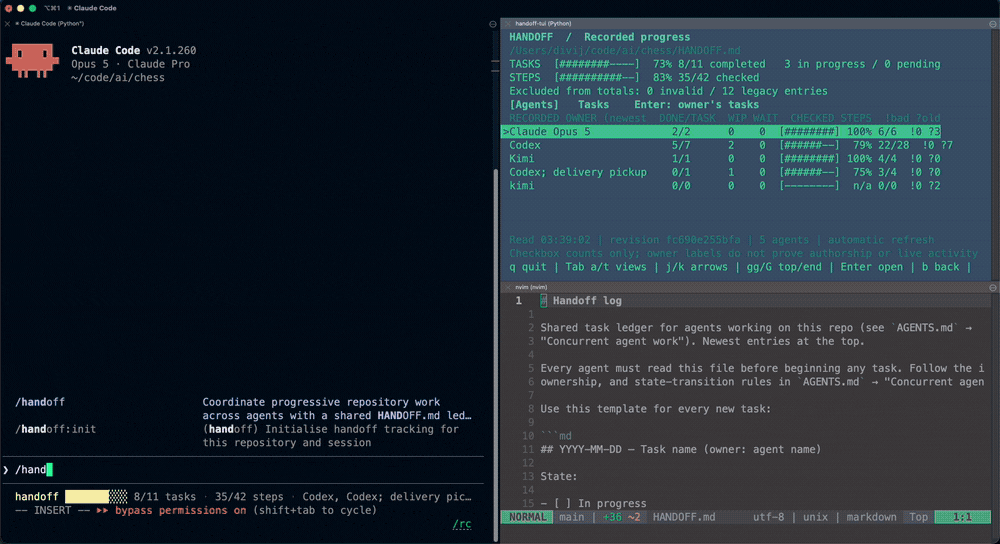
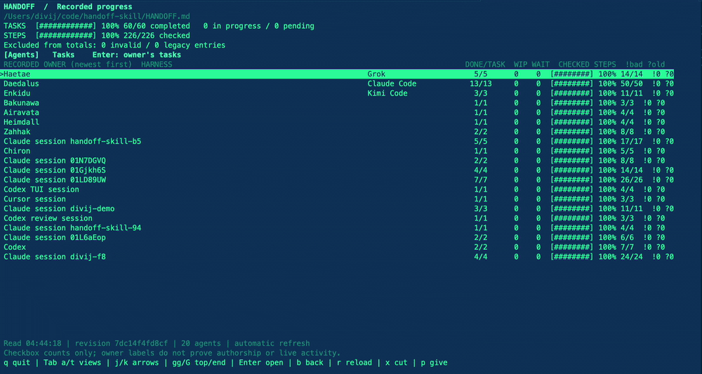

<p align="center">
  
</p>

# Handoff

> Keep AI agents from redoing finished work, overwriting active work, or losing context between sessions.

Handoff is an agent skill for repositories where work continues across multiple AI-agent sessions. It uses a shared `HANDOFF.md` ledger and repository evidence—Git history, current code, tests, and ownership—to determine what is **actually** unfinished.



A real session: `/handoff:continue` claims a name and runs preflight on the left while the dashboard on the right tracks five agents against the same ledger.

**Version:** 1.21.0

## Why Handoff?

An unchecked task is not always unfinished.

Another agent may have already implemented it. A commit may have satisfied it. The requirement may have changed. Or someone else may still own the affected files.

Before acting, Handoff helps an agent:

- Audit stale ledger entries against code, commits, and verification evidence
- Preserve work owned by another active agent
- Keep new requests visible without losing unfinished work
- Record a precise next action when a session stops mid-task
- Safely update the ledger when multiple agents share one working tree
- Name each session distinctly so the ledger and dashboard read as named agents rather than host session ids

## Install

### Claude Code

```bash
/plugin marketplace add divijshrivastava/handoff-skill
/plugin install handoff@divij-skills
```

Reload plugins or start a new Claude Code session after installation:

```bash
/reload-plugins
```

### Cursor

Import this repository as a marketplace, then install the **handoff** plugin:

1. **Team marketplace:** [Cursor dashboard](https://cursor.com/dashboard) → **Settings** → **Plugins** → **Team Marketplaces** → **Import Marketplace**, then paste `https://github.com/divijshrivastava/handoff-skill`
2. **In the IDE:** open **Customize** in the sidebar, search for **Handoff**, and **Install** (user or project scope). You can also type `/add-plugin` in the editor to reach the same panel.

The repo ships `.cursor-plugin/marketplace.json` and `.cursor-plugin/plugin.json` alongside the Claude Code manifests. Both marketplaces share the `divij-skills` name and the same version as `skills/handoff/SKILL.md`, generated by `scripts/sync_manifests.py`.

To publish on the public [Cursor Marketplace](https://cursor.com/marketplace/publish), submit the repository link after pushing these manifests.

### Other agent hosts

```bash
npx skills add divijshrivastava/handoff-skill --skill handoff
```

Add `-g` to install globally.

**Requirements:** Git, an agent with repository read/edit access, and Python 3.9+ for the optional helper. The live dashboard needs a POSIX terminal; the optional agent bar wrapper also needs tmux 3.2+. Handoff needs no API key, hosted service, or third-party Python package: everything above runs locally.

The one feature that leaves the machine is opt-in and is off until you configure it. `handoff_publish.py` copies the ledger and each agent's slice to a host you own, over `ssh`, using keys you already have. It is one way, it stores no credential, and it does nothing until `.handoff/vps.json` exists. See [publishing to a VPS](skills/handoff/references/vps-publish.md).

## Use it

In a repository that already keeps a `HANDOFF.md`, Handoff is already on: the ledger is the record that this repository tracks work this way, and an agent reads and audits it without being asked. Everywhere else you initialise it:

```text
/handoff:init
```

Codex has no slash commands, so write the phrase instead — the plugin's default prompt runs exactly this:

```text
initialise the handoff
```

Initialising claims a session name, audits the ledger, and reports what is actually unfinished; it starts no task by itself. It lazy-loads the skill: from then on the full workflow governs every repository request for the rest of the session — new work becomes ledger tasks, old entries get audited, ownership is checked — with no need to keep saying "use handoff". Explicit direction still steers it:

```text
Use handoff. Finish the unassigned migration first, then add the dashboard.
```

```text
Use handoff to pause this task with verification results and the exact next action.
```

```text
Use handoff to take over Codex's tasks.
```

Installing Handoff adds no hooks. In a repository with no ledger it does not run for a task you have not asked it to track: multiple agents sharing the tree, or unfinished-looking checkboxes, are **not** triggers on their own. An existing `HANDOFF.md` is, because a ledger nobody reads is worse than none - entries go stale and the next agent trusts checkboxes no one has audited.

### Activation triggers

Handoff work begins when one of these arrives:

| Trigger | Example |
| --- | --- |
| Existing ledger | the repository already has a `HANDOFF.md` |
| Init command | `/handoff:init` |
| Codex default prompt | "initialise the handoff" |
| Continue command | `/handoff:continue` |
| Status command | `/handoff:status` |
| View command | `/handoff:view` |
| Purge command | `/handoff:purge` |
| Direct instruction | "use handoff", "record this in the ledger", "purge the handoff", "take over Amaterasu's tasks" |

In a repository with no ledger and no such request, the agent does none of this skill's work: no session name, no preflight, no ledger creation, no task entry. It answers under the repository's own instructions instead.

## What happens

| Situation | Handoff does |
| --- | --- |
| An old task remains unchecked | Checks later commits, code, and ledger entries before treating it as unfinished |
| Work is already implemented | Records the evidence and resolves the stale entry instead of redoing it |
| Another agent owns related work | Preserves the work and reports the specific ownership conflict |
| A check fails | Keeps the task open with failure evidence and a concrete next action |
| A session ends mid-task | Leaves a useful, verifiable continuation point for the next agent |
| New work arrives | Queues it without silently discarding earlier unfinished work |
| You direct a takeover | Moves every open entry from the named owner after confirming they stopped and preserving their uncommitted work |
| You purge the ledger | Archives HANDOFF.md and leaves an empty valid ledger in its place |

## The workflow

Handoff treats the ledger as progressive history, not a flat todo list. Every session follows the same contract (defined in `skills/handoff/SKILL.md`):

1. **Preflight** — Claim a session name, read repository instructions, read the whole ledger (newest to oldest) from one versioned snapshot, run the structural doctor, and inspect Git history and active ownership.
2. **Intake** — Turn each request into a dated task entry with separate `In progress` and `Completed` boxes, concrete steps, verification, and a factual status line.
3. **Progressive audit** — For each apparently unfinished entry, weigh later ledger entries, commits, current source, live ownership, and the old entry's boxes. Classify the effective scope as **Complete**, **Partially complete**, **Superseded**, **Unfinished**, or **Unknown**. Preserve history by annotating rather than deleting.
4. **Ownership resolution** — When effective unfinished work exists alongside a new request, ask whether to finish eligible work first or leave it with its current owner and start the new task. An explicit ordering such as "finish X first, then Y" is already the choice.
5. **Safe writes** — Update the ledger at real transitions. When peers may write the same tree, route every write through the helper's locked compare-and-swap.
6. **Commit and stop** — Stage explicit paths only, record verification and commit identifiers, and leave enough state for the next agent to continue without this conversation.

### Task states

| State | In progress | Completed |
| --- | --- | --- |
| Pending or queued | `[ ]` | `[ ]` |
| Actively being worked | `[x]` | `[ ]` |
| Finished and verified | `[x]` | `[x]` |

Check `In progress` immediately before the first implementation step. Check `Completed` only after every required step and proportionate verification finish. Completed tasks keep `In progress` checked to preserve transition history.

## The ledger

Handoff stores project work in a root-level `HANDOFF.md`. Each task records ownership, optional harness, state, completed steps, evidence, and the next action.

```md
## 2026-09-07 — Add search (owner: Amaterasu) (harness: Claude Code)

State:
- [x] In progress
- [ ] Completed

Steps:
- [x] Implement search filtering.
- [ ] Verify empty-query and no-results behavior.
- [ ] Record verification and the next action.

Status: Filtering exists. Edge-case verification remains.
Next action: Add and run empty-query/no-results tests.
```

The optional `(harness: ...)` field records which tool the owning session ran in. It is separate from the owner label so names survive round trips through headings. The helper auto-detects Claude Code, Codex, Cursor, and VS Code from environment variables; set `$HANDOFF_HARNESS` to override or name an unrecognised tool. Use `--harness auto` on the template command to include it. When a task is reassigned, the harness field is dropped so the new owner records its own.

Completed tasks retain both state boxes checked, so the ledger remains useful as history. See the full [ledger contract](skills/handoff/references/ledger-contract.md) for formatting rules, ownership notes, progressive resolution examples, and superseded-entry patterns.

## Session naming

Every session claims a name as its first action, before reading or reporting anything:

```bash
python3 skills/handoff/scripts/handoff_guard.py name --root /path/to/your/repo
```

Names come from a roster of a hundred mythological figures worldwide. They are handed out first come, first served, cycling initials A through Z and wrapping to the next free A name after Z. A name is never one an owner in that ledger already holds (completed entries included), and the same session asking twice gets the same name.

- `$HANDOFF_SESSION` identifies a session whose host exposes no id of its own
- `--seed` names one explicitly
- `$HANDOFF_NAME_CACHE` moves the claim cache directory

The name identifies a session, not a person or model, and proves nothing about who performed a step. It is how a later agent tells your entries from a peer's, and how the dashboard groups them.

## Agent communication and exhausted sessions

An agent's CLI can remain open after it hits a usage limit. Handoff now has a
local inbox and explicit capability reports so peers can distinguish a resident
process from an agent that can still respond.

The Claude Code plugin includes command hooks. `SessionStart` registers the
session and claims its name; `StopFailure` reports host errors to peers without
calling the failed model. `PostToolUse` and `UserPromptSubmit` deliver unread
message previews to a receiving agent on its next model request. Hooks do nothing
in repositories without `HANDOFF.md`. The ZIP/`.skill` includes the adapter script
and setup instructions; installing the skill alone does not install host hooks.

Other harnesses can use the same standard-library CLI:

```sh
python3 skills/handoff/scripts/handoff_channel.py --root /path/to/repo peers
python3 skills/handoff/scripts/handoff_channel.py --root /path/to/repo inbox \
  --session '<your registered session ID>' --wait 30
```

The channel stores messages and acknowledgements in a gitignored local SQLite
file. It is scoped to one checkout, with no daemon or socket required. Agents can
send questions, reply, report availability, and voluntarily `yield` their entire
unfinished bucket through the existing ledger lock. Released tasks become
unassigned with their prior ownership and remaining work recorded. Two receivers
must still use guarded ledger writes to claim work.

A stale report means unknown capability. A rate-limit or output-token error does
not automatically establish exhausted quota, stopped child processes, or transfer
a task. A confirmed unavailable CLI does not have to exit merely to allow an
otherwise authorized takeover.

Because no signal for an exhausted model exists on every harness, and silence
cannot tell an exhausted agent from an idle healthy one, exhaustion is handled by
construction instead of detection. An owner declares its own renewal deadline on
its unfinished bucket, and any peer releases what expired - the verdict is
arithmetic every harness computes alike:

```sh
python3 skills/handoff/scripts/handoff_guard.py lease --root /path/to/repo \
  --owner '<your name>' --hours 6 --expect-version '<version from read>'
python3 skills/handoff/scripts/handoff_guard.py sweep --root /path/to/repo \
  --expect-version '<version from read>'
```

`challenge` and `attest` bind a proof of capability to a fresh nonce, so a peer
can establish that another agent is up - reason not to take its work. Read it in
that direction only: no answer stays unknown. See
[channel usage and failure-hook setup](skills/handoff/references/agent-channel.md)
for registration, release, recovery, and the host support limits.

## Live progress dashboard

Watch overall completion and each agent's recorded progress while they work:

```bash
python3 skills/handoff/scripts/handoff_tui.py --root /path/to/your/repo
```

Run this from a checkout of this repository, or use the script's path inside your installed handoff skill. It refreshes every second as agents save ledger updates.



### Views

- **Agents** — Groups totals by the exact owner label in each heading. Shows completed/total tasks, in-progress tasks, pending tasks, step progress, and (when recorded) the harness each owner used. Owners appear in ledger order (newest first), not alphabetically. A `(recent)` suffix marks sessions that claimed a name on this machine in the last 15 minutes — that is a recent claim, not proof the agent is running.
- **Tasks** — Lists every entry in ledger order with state, step counts, and owner. Press Enter to inspect steps and full status text.

### Controls

| Key | Action |
| --- | --- |
| Tab, a, t | Switch views, or open Agents / Tasks directly |
| Up/Down, k/j | Select a row or scroll task details |
| Page Up/Page Down, Home/End | Move through long lists or details |
| gg, G | Jump to the first or last line |
| Enter | Open the selected owner's tasks or task details |
| b, Escape, Backspace | Close details, then clear the owner filter |
| r | Refresh immediately |
| x | Cut the selected task, or put a held one back |
| p | Give the held task to the selected agent or task's owner |
| P | Give the held task to an owner name you type |
| q, Ctrl-C | Quit and restore the terminal |

Live mode needs at least 64 columns and 14 rows. Pass `--read-only` for a terminal that must never write.

Press `c` to browse the local agent channel: sender, recipient, time,
acknowledgements, and message text. Enter opens the full message; `s` lists
sessions, and Enter on a session filters its recent conversation. The newest
200 messages refresh automatically. Reading the viewer never acknowledges a
message for an agent, and reported state does not prove live activity.

### Handing a task to another agent

When an agent is about to run out of context, select the task, press `x` to cut it, then press `p` on the receiving agent (or `P` to type a name). That rewrites the task's owner label, drops its harness field, appends a dated note to its status, and uses the same locked compare-and-swap as the writer helper. State, steps, and ledger order stay untouched — order records when work was raised; the label records who holds it.

**An assignment is an instruction to finish the task.** Every receiving agent
must finish its current task, then audit and complete viewer-assigned work,
including verification, without waiting for another prompt. An idle agent
starts after its audit. Agents check their queue at task boundaries and before
stopping, preserve prior work, and record any concrete blocker while continuing
other eligible assignments. The saved move note carries this instruction.
Completed work is not reopened, and moving to `unassigned` releases it.
The viewer cannot wake a stopped model; the instruction takes effect when the
agent next runs and reads its queue.

You can also hand one agent another agent's whole bucket: tell the receiving agent to take over, naming the prior owner. It preserves the prior owner's uncommitted work to a recovery point outside the tree, moves every open entry in one locked ledger write, and records the transfer in each entry's status, so the prior owner sees the move the next time it audits the ledger and reports it instead of resuming.

### Snapshot and path options

```bash
handoff-tui --root /path/to/your/repo --once          # plain-text snapshot
handoff-tui --root /path/to/your/repo --interval 2    # change refresh rate (0.1–60 s)
handoff-tui --file /path/to/handoff.md                # explicit ledger filename
handoff-tui --root /path/to/your/repo --read-only     # never write
```

Live mode uses Python's standard-library curses module on macOS/Linux; snapshot mode also works without curses. No package installation or service is needed.

### PATH launcher

A plugin install lives under a version-pinned directory, so a command line naming one breaks at the next release. The skill ships a launcher that resolves the viewer at run time; copy it once onto your PATH:

```bash
cp skills/handoff/scripts/handoff-tui ~/.local/bin/ && chmod +x ~/.local/bin/handoff-tui
handoff-tui --root /path/to/your/repo
```

It takes the same flags, plus `--which` to print the copy it resolved. Copy it rather than symlinking, so it does not point back into a version-pinned path. Resolution order: `$HANDOFF_TUI`, a sibling `handoff_tui.py`, project and global `.agents`/`.codex` skill installs, the registered plugin install, the plugin cache and marketplace directories, then `$HANDOFF_SKILL_REPO`.

Percentages reflect recorded checkboxes and heading owners. They do not measure effort or verify who performed a step; stale entries still need an audit. See [controls and counting rules](skills/handoff/references/progress-viewer.md).

## Slash commands

Installed as a Claude Code plugin, the skill adds five commands:

| Command | Purpose |
| --- | --- |
| `/handoff:init` | Initialise handoff tracking: claim a session name, audit the ledger, report |
| `/handoff:view` | Open the live progress viewer in a separate terminal |
| `/handoff:status` | Turn on a live progress bar in the status line, and report progress |
| `/handoff:continue` | Audit the ledger and resume what is actually unfinished |
| `/handoff:purge` | Archive the ledger and replace it with an empty valid one |

`/handoff:init` is how a repository without a ledger becomes one that tracks work this way (or the phrase "initialise the handoff" in Codex, whose default prompt runs it). Where a `HANDOFF.md` already exists it only reports the recorded state. Either way it establishes tracking without starting any task.

`/handoff:continue` runs the full progressive audit and resumes the oldest effectively unfinished entry (or the one you name). It does not invent scope or create a ledger if none exists.

`/handoff:purge` is authorized history erasure: it archives the current `HANDOFF.md` and leaves an empty valid ledger in its place. It does not delete the file, so the repository stays one that tracks work this way. Later work starts as new entries. Codex has no slash commands, so write "purge the handoff".

`/handoff:view` opens the live dashboard in a real terminal window because a command session has no controlling terminal for curses:

```bash
handoff-tui --open --root /path/to/your/repo
```

If `handoff-tui` is not on PATH, copy the launcher first. When you are already at a shell, `handoff-tui --root <target>` in the foreground also works.

`/handoff:status` puts a live row at the bottom of Claude Code:

```
handoff █████████░ 17/18 tasks · 70/73 steps · Codex
```

It configures Claude Code's [status line](https://code.claude.com/docs/en/statusline) to run `handoff-bar`, which prints one row and exits. With a refresh interval set, the bar keeps updating while the session is idle, so progress moves as other agents write the ledger. `/handoff:status off` removes it. The bar prints nothing in a repository without a ledger, so it stays empty rather than erroring.

The command also reports the totals and per-owner table the bar has no room for. Both show *recorded* progress; `/handoff:continue` is the one that runs the progressive audit. For the full dashboard with drilldown, run `handoff-tui` in your own terminal — Claude Code owns the one it is running in.

### Other agent harnesses

The bar is not Claude Code specific. `handoff-bar` reads the status-line payload shapes all of these send, so the same script works unchanged:

| Harness | Live bar | Configure in |
| --- | --- | --- |
| Claude Code 2.1.260 | Yes | `~/.claude/settings.json` → `statusLine` |
| Grok CLI 1.0.13 | Yes | `~/.grok/config.toml` → `[ui.status_line]` |
| Kimi Code 0.41.0 | Yes | `~/.kimi-code/tui.toml` → `[status_line]` |
| Codex CLI 0.153.4 | Via tmux wrapper | `handoff-tui --codex` |
| Any agent CLI | Via tmux wrapper | `handoff-tui --with <agent>` |
| opencode 1.18.3 | Built-in segments only | — |
| Cursor agent | None found | — |

Use `handoff-bar`, not `handoff-tui --bar`, in status-line configuration: hosts cap how long a status-line command may take (Kimi's cap is 300 ms), and `handoff-bar` caches its row against the ledger's content hash so a tick costs about 31 ms rather than 250 ms for a fresh Python start.

Claude Code, Grok, and Kimi rows were each confirmed in a live session. Grok refreshes on session events, so its row appears once you interact rather than on the first empty frame.

Harnesses without a status-line hook still get the full dashboard: run `handoff-tui` in a second terminal, which needs nothing from the host. Exact configuration and the measurements behind the design are in [harness setup](skills/handoff/references/harness-setup.md).

On Windows the ledger helper and the snapshot and bar modes work, but the live curses dashboard and the `handoff-bar` fast path do not; point the status line at `python handoff_tui.py --bar`, or use WSL for the dashboard. CI runs the suites on Ubuntu and Windows.

## Agent bar wrapper (Codex and any CLI)

Run an agent CLI and keep a live Handoff progress bar at the bottom of the same terminal:

```bash
./skills/handoff/scripts/handoff-tui --codex
# Or, after copying the launcher onto PATH:
handoff-tui --root /path/to/your/repo --codex
handoff-tui --root /path/to/your/repo --codex resume --last
```

Requires the agent CLI and tmux 3.2+ on PATH (macOS/Linux or WSL). Put viewer options such as `--root`, `--file`, `--interval 2`, and `--no-color` before `--codex`; everything after it goes to the agent. The bar refreshes while idle and shows recorded task and step counts plus open owners.

Nothing in that wrapper is agent-specific. `--with` runs the same bar and the same viewer key around any agent CLI on PATH:

```bash
handoff-tui --with claude
handoff-tui --root /path/to/your/repo --with kimi
handoff-tui --root /path/to/your/repo --with grok -p "what is left?"
```

`--codex` is simply `--with codex`. Each invocation owns a private tmux socket, ignores `~/.tmux.conf`, and removes its server when the agent exits. Prefix shortcuts are disabled so keys reach the agent, with one exception: the viewer key opens the live dashboard in a popup.

Press `Ctrl-G` to open the live viewer in a popup over the agent, hand a task to another agent with `x` and `p`, then `q` to drop back to the prompt. The row ends with `^G open` while that key is bound; `$HANDOFF_VIEWER_KEY` moves it to another tmux key or turns it off with `none`, and `--read-only` opens a viewer that cannot write.

No harness can bind a key to an arbitrary command of its own — Claude Code's `keybindings.json` accepts only its own fixed actions — so the key is bound in tmux's root table, which resolves it before the agent sees it. In an *unwrapped* session, both Codex and Claude Code use `Ctrl-G` for their external editor. Installing the skill does not intercept it.

### Installing the viewer key

To install the viewer key in a supported terminal, run:

```bash
handoff-tui --install-viewer-key
```

The installer detects the terminal. In **iTerm2** it creates a dedicated Handoff profile and merges a global shortcut that opens the viewer in a new window. Set `HANDOFF_VIEWER_KEY=C-M-h` before the iTerm2 install command to use `Ctrl+Alt+H` (`Control+Option+H` on macOS). Keep `Ctrl+V` for Codex image paste. Changing the key removes previous shortcuts to the same repository's viewer.

In **Cursor** the same key works inside the integrated terminal: `--emulator cursor` binds it to a `Handoff viewer` workspace task and adds that command to `terminal.integrated.commandsToSkipShell`, so Cursor answers the key instead of passing it to the shell.

The **Claude-only** path releases `Ctrl-G` and moves its editor action to `Ctrl-E`, but cannot launch the viewer itself — use `/handoff:view` or `handoff-tui --with claude` for a key that actually opens the dashboard. **kitty** and **wezterm** receive marked configuration snippets.

See [the key and its host override](skills/handoff/references/harness-setup.md#releasing-the-key-in-the-host) and [Codex setup and limits](skills/handoff/references/harness-setup.md#codex-cli).

## Multi-agent safety

For normal sequential work—or separate Git worktrees—editing `HANDOFF.md` directly is fine.

When several agents share **one working tree**, use the bundled `apply` command. It performs a locked, compare-and-swap update so one agent cannot silently overwrite another agent's ledger change. The helper holds an exclusive lock on a `HANDOFF.md.lock` sidecar across re-read, version check, and atomic replace. The payload is read before the lock is taken so blocking stdin cannot stall peers.

The skill's always-visible description includes the sequence: claim a name with
`name`, take one ledger snapshot with `read`, audit it, then write with
`apply --expect-version`. This puts the essential commands in front of an agent
before it loads the full skill instructions. On exit `3`, read again and
re-audit before preparing a new write; retrying stale content can lose a peer's
work. Tests check that the description retains the commands in order and fits
the recorded host limits. Marketplace listings keep the short purpose statement;
the [contributor guide](CONTRIBUTING.md#skill-descriptions) records the limits
and this decision. These checks verify placement, not model behavior.

<details>
<summary>Safe concurrent update example</summary>

```bash
# Claim this session's name before starting the audit
python3 skills/handoff/scripts/handoff_guard.py name \
  --root /absolute/path/to/repo

# Read a consistent snapshot and its version
python3 skills/handoff/scripts/handoff_guard.py read \
  --root /absolute/path/to/repo

# After auditing the returned text, write only if that version is still current
python3 skills/handoff/scripts/handoff_guard.py apply \
  --root /absolute/path/to/repo \
  --expect-version 98caeaf3ffbe \
  --entry new-entry.md
```

Use `--entry` to insert one new task at the newest position, or `--content` to replace the whole ledger after editing existing entries; either accepts `-` for stdin.

Exit codes:

| Code | Meaning |
| --- | --- |
| `0` | Applied |
| `1` | Usage error or missing ledger |
| `3` | Version conflict — re-read, re-audit, do not retry stale content |
| `4` | Write would introduce structural errors |

</details>

## Helper commands

All commands accept `--root` with a repository path or child directory.

```bash
# Diagnose ledger structure
python3 skills/handoff/scripts/handoff_guard.py doctor \
  --root /absolute/path/to/repo

# Validate structure, including machine-readable output
python3 skills/handoff/scripts/handoff_guard.py validate \
  --root /absolute/path/to/repo --json

# Read ledger text and version from one snapshot
python3 skills/handoff/scripts/handoff_guard.py read \
  --root /absolute/path/to/repo

# Name this session, to own its ledger entries under
python3 skills/handoff/scripts/handoff_guard.py name \
  --root /absolute/path/to/repo

# Generate a task-entry template
python3 skills/handoff/scripts/handoff_guard.py template \
  --title "Add search" \
  --owner "Amaterasu" \
  --step "Implement search filtering." \
  --step "Verify behavior and update the handoff." \
  --harness auto
```

Additional flags:

- `read --out FILE` — write ledger text to a file instead of stdout
- `name --seed ID` — identify the session explicitly; `name --json` includes detected harness
- `template --harness auto` — record the detected tool; `--harness ""` opts out
- `apply --dry-run` — report without writing
- `apply --allow-structure-errors` — repair a malformed ledger, not for pushing past a failed check
- `apply --json` — machine-readable result

The helper validates ledger structure only. It cannot determine whether a feature is really implemented, whether ownership is active, or whether a requirement is obsolete—those are evidence-based decisions made by the agent. A passing `validate` is never evidence that a task is finished.

## Environment variables

| Variable | Used by | Purpose |
| --- | --- | --- |
| `$HANDOFF_SESSION` | `name` | Session id when the host exposes none |
| `$HANDOFF_HARNESS` | `name`, `template` | Override auto-detected harness label |
| `$HANDOFF_NAME_CACHE` | `name` | Move the session-name claim cache |
| `$HANDOFF_TUI` | `handoff-tui`, `handoff-bar` | Pin the viewer script path |
| `$HANDOFF_SKILL_REPO` | `handoff-tui` | Point at a source checkout |
| `$HANDOFF_VIEWER_KEY` | bar wrapper, key installer | tmux key for the popup viewer (`none` to disable) |
| `$HANDOFF_PYTHON` | `handoff-bar` | Python interpreter for `--bar` |
| `$HANDOFF_BAR_CACHE` | `handoff-bar` | Move the status-line row cache |
| `$CLAUDE_CONFIG_DIR` | `handoff-tui` | Non-default Claude plugin directory |

## Named failure modes

Handoff is designed around mistakes observed in multi-agent work:

- **Checkbox literalism** — treating an old unchecked item as unfinished without reading later history or current source
- **History erasure** — rewriting or deleting an earlier task instead of annotating how later work resolved it
- **Silent takeover** — editing a task or files still owned by an active agent without an explicit handoff
- **Silent reclaim** — resuming a task the ledger shows transferred to another owner
- **Lost queued request** — finishing older work without preserving the user's newer request as a pending entry
- **Premature completion** — checking `Completed` before required verification, commit, or handoff work is done
- **Private-context handoff** — leaving "continue later" without state, evidence, blocker, and next action
- **Broad staging** — catch-all staging in a shared working tree
- **Blind overwrite** — writing the ledger from a read another agent has already superseded

## Updates

### Claude Code plugin

```bash
/plugin marketplace update divij-skills
/plugin update handoff@divij-skills
/reload-plugins
```

Third-party marketplaces have auto-updates disabled by default. Enable them from `/plugin` → **Marketplaces** → **divij-skills** → **Enable auto-update**.

### Skills CLI

```bash
# Project install
npx skills@latest update handoff -p

# Global install
npx skills@latest update handoff -g
```

## Manual installation

Clone this repository and copy the **entire** `skills/handoff` directory into your host's skills directory—for example:

```text
.claude/skills/handoff/
```

Do not copy only `SKILL.md`: the references and helper scripts are part of the skill.

## Development

```bash
python3 -m unittest discover -s skills/handoff/tests -v
python3 -m unittest discover -s tests -v
python3 scripts/check_versions.py
python3 skills/handoff/scripts/handoff_guard.py validate --root .
python3 scripts/package_skill.py
```

The packager creates release artifacts in `dist/`. See [CONTRIBUTING.md](CONTRIBUTING.md) for contribution and release guidance.

## Scope

Handoff is a coordination convention, not a permissions system or general-purpose lock manager. It never lets an agent take over another agent's work on its own initiative, commit unrelated changes, or publish changes. A takeover happens only when you direct it and name the prior owner; the agent must then find that owner stopped, preserve its uncommitted work, and record the transfer in the ledger where the prior owner will see it.

## Further reading

| Document | Contents |
| --- | --- |
| [SKILL.md](skills/handoff/SKILL.md) | Runtime contract for agents |
| [ledger-contract.md](skills/handoff/references/ledger-contract.md) | Ledger format spec |
| [progress-viewer.md](skills/handoff/references/progress-viewer.md) | Dashboard controls, counting rules, bar mode |
| [harness-setup.md](skills/handoff/references/harness-setup.md) | Per-harness status-line setup, platform matrix, key installer |
| [design-notes.md](skills/handoff/references/design-notes.md) | Lineage and design influences |

## License

[MIT](LICENSE)
